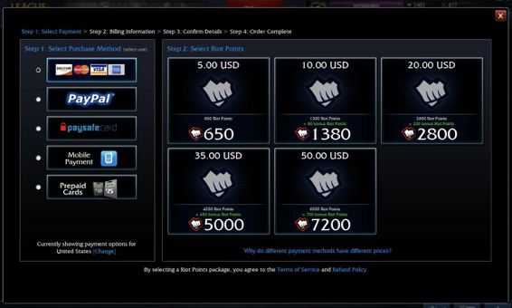
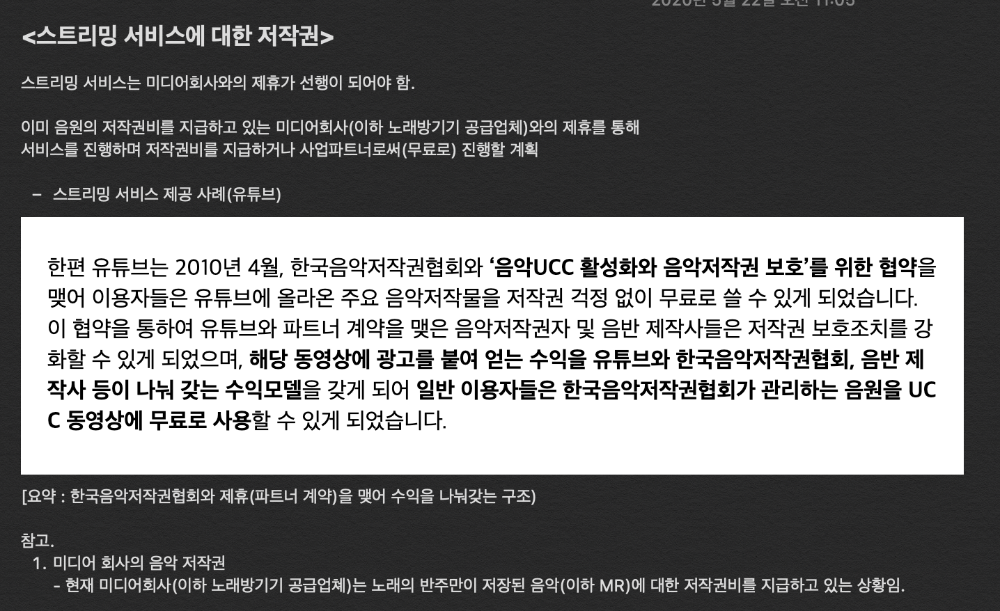

# kisa-SongPay
KISA 핀테크 프로젝트 개발 과정 최우수상작


## 1. 서비스 설명

```
코인노래방 간편결제 서비스
: 지폐나 카드로 결제했던 과거 방식에서 탈피해 애플리케이션 하나로 결제부터 곡 수 선택까지 할 수 있도록 만든 간편결제 서비스
```


## 2. 서비스 특징

```
1) 송금을 통한 코인 충전 -> 원하는 만큼만 차감하여 사용

2) 수단과 장소의 제약을 받지 않는 결제 -> 언제 어디서나 간편하게 결제 가능

3) 이용자를 유입하기 위한 Gamification 요소 (향후 보완 예정)
```


## 3. 시연 영상

<video src="README.assets/songPay.mp4"></video>


## 4. 비즈니스 모델

```
1. 클라이언트 관점

간편 송금과 Gamification 요소를 통한 고객 유입
카드 결제보다 저렴한 수준의 수수료 지불
카드 단말기나 키오스크 설치 비용 대비 저렴한 서버 유지 비용
```

```
2. 서비스 수익 모델

1) 충전 후 낙전 금액 수수료 수익
```



```
2) 송금 수수료 
: 카드 결제보다 저렴한 수준에서 책정해 클라이언트를 유입

3) 동영상 스트리밍 수익 **저작권 문제
: 노래 콘텐츠 중심의 스트리밍 서비스를 제공해 부가 수익 창출
```

** 저작권 문제




